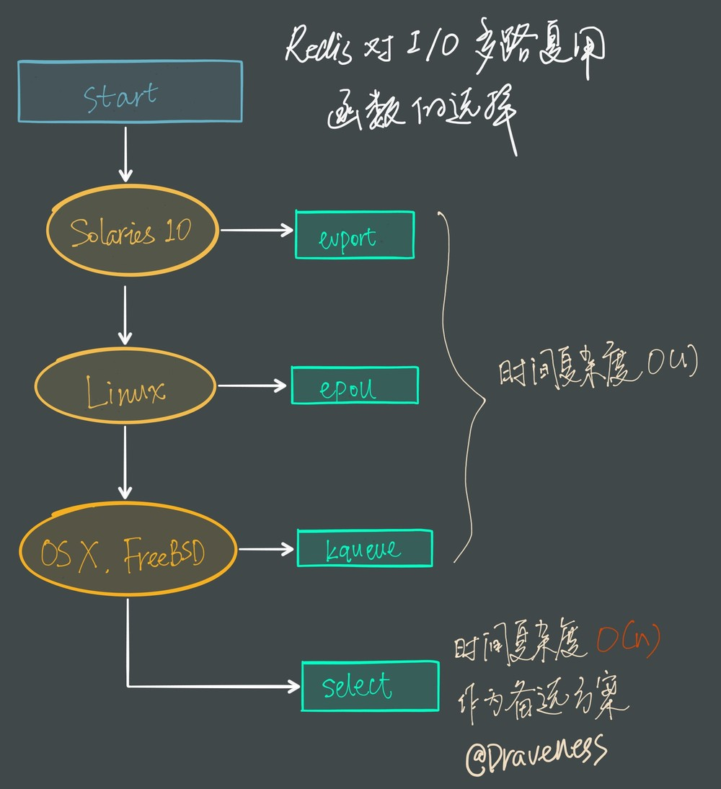
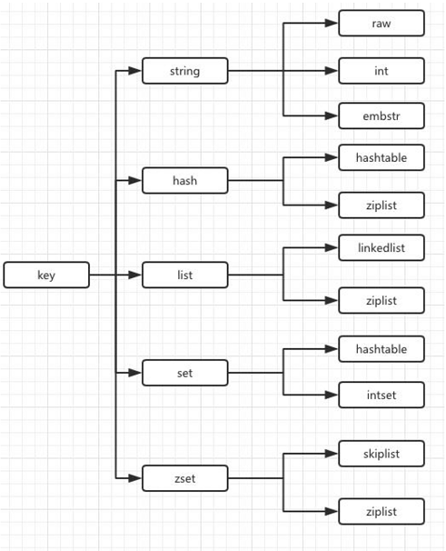

<!-- MarkdownTOC levels="1,2,3,4,5" autolink="true"  style="unordered" -->

- [1. Redis线程模型](#1-redis%E7%BA%BF%E7%A8%8B%E6%A8%A1%E5%9E%8B)
	- [Redis线程模型](#redis%E7%BA%BF%E7%A8%8B%E6%A8%A1%E5%9E%8B)
	- [redis单线程模型也能效率这么高？](#redis%E5%8D%95%E7%BA%BF%E7%A8%8B%E6%A8%A1%E5%9E%8B%E4%B9%9F%E8%83%BD%E6%95%88%E7%8E%87%E8%BF%99%E4%B9%88%E9%AB%98%EF%BC%9F)
- [2. I/O 多路复用程序的实现](#2-io-%E5%A4%9A%E8%B7%AF%E5%A4%8D%E7%94%A8%E7%A8%8B%E5%BA%8F%E7%9A%84%E5%AE%9E%E7%8E%B0)
	- [select](#select)
	- [poll](#poll)
	- [epoll](#epoll)
		- [epoll 相关函数：](#epoll-%E7%9B%B8%E5%85%B3%E5%87%BD%E6%95%B0%EF%BC%9A)
		- [epoll的三大关键要素：](#epoll%E7%9A%84%E4%B8%89%E5%A4%A7%E5%85%B3%E9%94%AE%E8%A6%81%E7%B4%A0%EF%BC%9A)
		- [epoll对文件描述符的操作有两种模式：](#epoll%E5%AF%B9%E6%96%87%E4%BB%B6%E6%8F%8F%E8%BF%B0%E7%AC%A6%E7%9A%84%E6%93%8D%E4%BD%9C%E6%9C%89%E4%B8%A4%E7%A7%8D%E6%A8%A1%E5%BC%8F%EF%BC%9A)
- [3. Redis数据结构](#3-redis%E6%95%B0%E6%8D%AE%E7%BB%93%E6%9E%84)
	- [哈希对象](#%E5%93%88%E5%B8%8C%E5%AF%B9%E8%B1%A1)
	- [字符串对象](#%E5%AD%97%E7%AC%A6%E4%B8%B2%E5%AF%B9%E8%B1%A1)
	- [集合对象](#%E9%9B%86%E5%90%88%E5%AF%B9%E8%B1%A1)
	- [列表对象](#%E5%88%97%E8%A1%A8%E5%AF%B9%E8%B1%A1)
	- [有序集合对象](#%E6%9C%89%E5%BA%8F%E9%9B%86%E5%90%88%E5%AF%B9%E8%B1%A1)

<!-- /MarkdownTOC -->


## 1. Redis线程模型
#### Redis线程模型

Redis 基于 Reactor 模式开发了自己的网络事件处理器： 这个处理器被称为文件事件处理器（file event handler）


I/O 多路复用程序负责监听多个套接字(Socket)， 并向文件事件分派器传送那些产生了事件的套接字。


尽管多个文件事件可能会并发地出现， 但 I/O 多路复用程序总是会将所有产生事件的套接字都入队到一个队列里面，
然后通过这个队列， 以有序（sequentially）、同步（synchronously）、每次一个套接字的方式向文件事件分派器传送套接字


#### redis单线程模型也能效率这么高？

1. 纯内存操作
2. 基于非阻塞的IO多路复用机制
3. 单线程避免了多线程的切换（上下文切换）性能损耗问题


## 2. I/O 多路复用程序的实现


#### select

#### poll

#### epoll

```
　　int epfd,nfds;
　　struct epoll_event ev,events[5]; //ev用于注册事件，数组用于返回要处理的事件
　　epfd = epoll_create(1); //只需要监听一个描述符——标准输入
　　ev.data.fd = STDIN_FILENO;
　　ev.events = EPOLLIN|EPOLLET; //监听读状态同时设置ET模式
　　epoll_ctl(epfd, EPOLL_CTL_ADD, STDIN_FILENO, &ev); //注册epoll事件
　　for(;;)
　　{
　　　　nfds = epoll_wait(epfd, events, 5, -1);
　　　　for(int i = 0; i < nfds; i++)
　　　　{
　　　　　　if(events[i].data.fd==STDIN_FILENO)
　　　　　　{　　
                printf("welcome to epoll's word!\n");
           }

　　　　}
　　}

```

##### epoll 相关函数：
- `int epoll_create(int size);`
用于创建一个 epoll 句柄，会占用一个 fd 描述符
 
- `int epoll_ctl(int epfd, int op, int fd, struct epoll_event *event);`
添加或者删除所有需监控的连接
 
- `int epoll_wait(int epfd, struct epoll_event * events, int maxevents, int timeout);`
可以理解为收集监控的所有活跃的连接

##### epoll的三大关键要素：

- mmap   
  将用户空间的一块地址和内核空间的一块地址同时映射到相同的一块物理内存地址
  （用户空间和内核空间都是虚拟地址，要通过地址映射映射到物理地址），使得这块物理内存对内核和对用户均可见，减少用户态和内核态之间的数据交换
- 红黑树   
  epoll在实现上采用红黑树去存储所有套接字，当添加或者删除一个套接字时（epoll_ctl），
  都在红黑树上去处理，红黑树本身插入和删除性能比较好，时间复杂度O(logN)
- 链表   
  一旦有事件发生，epoll就会将该事件添加到双向链表中。
  那么当我们调用epoll_wait时，epoll_wait只需要检查rdlist双向链表中是否有存在注册的事件。
  


- evport：Solaries 10
- epoll：Linux
- kqueue： macOS/FreeBSD
- select：如果当前编译环境没有上述函数，就会选择

前三个函数都使用了内核内部的结构，并且能够服务几十万的文件描述符


##### epoll对文件描述符的操作有两种模式：

**ET(边缘触发)**：Nginx 就是采用 ET 触发方式，只支持 no-block 方式，当一个 fd 缓冲区就绪的时候，只会发送一次事件触发， 而不会管缓冲区的数据是否已经被读取，都不会再发送第二次

**LT(电平触发)**：LT模式是默认模式。支持no-block 和 block 两种方式，当一个 fd 缓冲区就绪时，只要缓冲区有数据，就会不停的发送就绪通知


## 3. Redis数据结构



#### 哈希对象  
哈希对象的编码可以是 ziplist 或者 hashtable

ziplist: 


- 保存了同一键值对的两个节点总是紧挨在一起， 保存键的节点在前， 保存值的节点在后；
- 先添加到哈希对象中的键值对会被放在压缩列表的表头方向， 而后来添加到哈希对象中的键值对会被放在压缩列表的表尾方向。

hashtable:


当哈希对象可以同时满足以下两个条件时， 哈希对象使用 ziplist 编码：

- 哈希对象保存的所有键值对的键和值的字符串长度都小于 64 字节；
- 哈希对象保存的键值对数量小于 512 个；

不能满足这两个条件的哈希对象需要使用 hashtable 编码。
 
> 这两个条件的上限值是可以修改的， 具体请看配置文件中关于 hash-max-ziplist-value 选项和 hash-max-ziplist-entries 选项的说明。

#### 字符串对象
字符串对象的编码可以是 int 、 raw 或者 embstr

#### 集合对象
集合对象的编码可以是 intset 或者 hashtable

#### 列表对象
列表对象的编码可以是 ziplist 或者 linkedlist

当列表对象可以同时满足以下两个条件时， 列表对象使用 ziplist 编码：

- 列表对象保存的所有字符串元素的长度都小于 64 字节；
- 列表对象保存的元素数量小于 512 个；

不能满足这两个条件的列表对象需要使用 linkedlist 编码。
> 以上两个条件的上限值是可以修改的， 具体请看配置文件中关于 list-max-ziplist-value 选项和 list-max-ziplist-entries 选项的说明。


#### 有序集合对象
有序集合的编码可以是 ziplist 或者 skiplist 。

skiplist: 


当有序集合对象可以同时满足以下两个条件时， 对象使用 ziplist 编码：

- 有序集合保存的元素数量小于 128 个；
- 有序集合保存的所有元素成员的长度都小于 64 字节；
 
不能满足以上两个条件的有序集合对象将使用 skiplist 编码。

> 以上两个条件的上限值是可以修改的， 具体请看配置文件中关于 zset-max-ziplist-entries 选项和 zset-max-ziplist-value 选项的说明。
