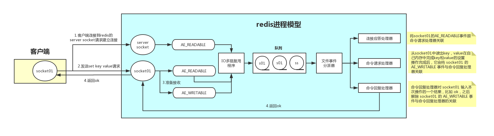
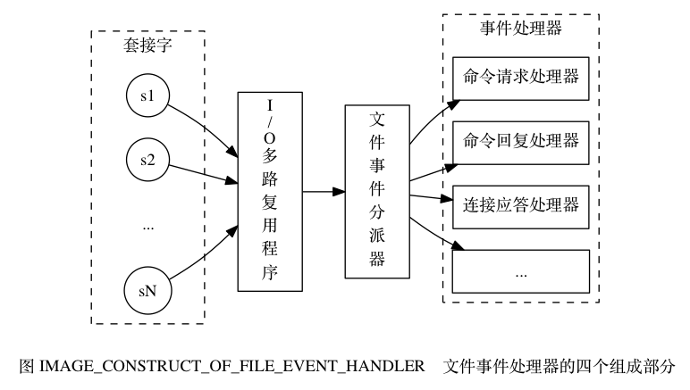
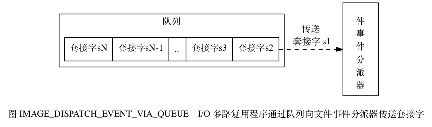
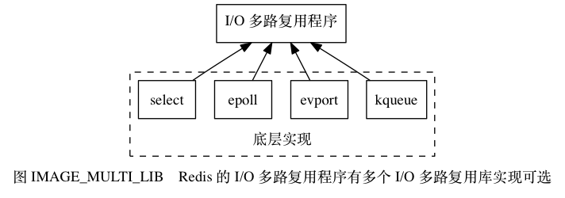
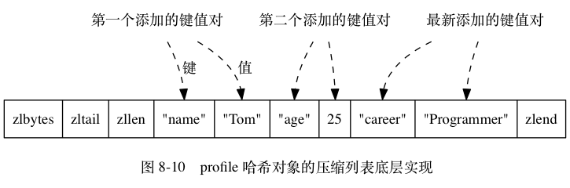
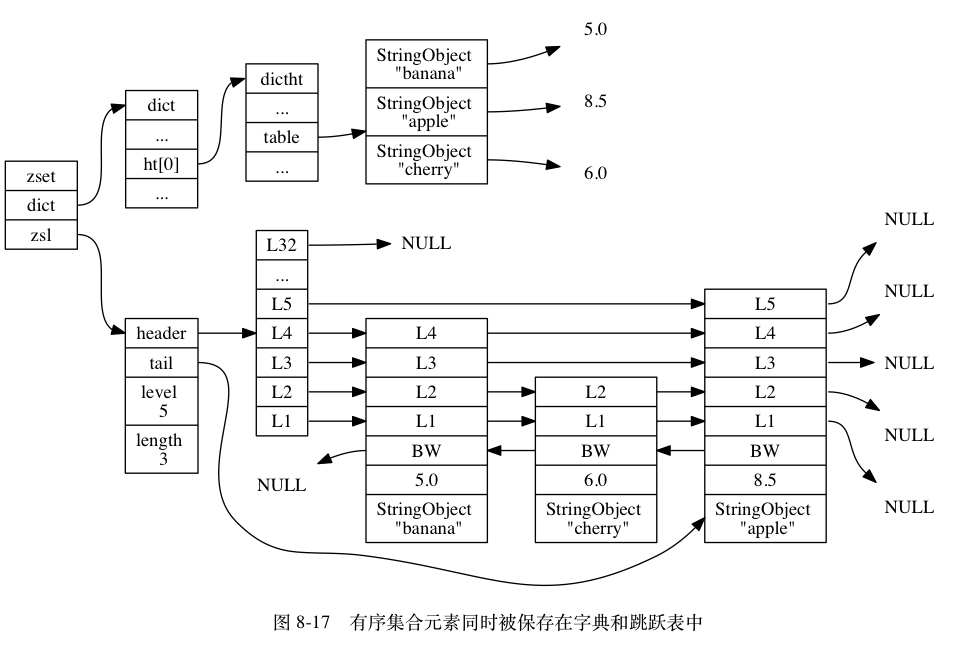

## redis模型
Redis 基于 Reactor 模式开发了自己的网络事件处理器： 这个处理器被称为文件事件处理器（file event handler）

I/O 多路复用程序负责监听多个套接字(Socket)， 并向文件事件分派器传送那些产生了事件的套接字。

尽管多个文件事件可能会并发地出现， 但 I/O 多路复用程序总是会将所有产生事件的套接字都入队到一个队列里面，
然后通过这个队列， 以有序（sequentially）、同步（synchronously）、每次一个套接字的方式向文件事件分派器传送套接字

### I/O 多路复用程序的实现

#### redis单线程模型也能效率这么高？

1. 纯内存操作
2. 核心是基于非阻塞的IO多路复用机制
3. 单线程反而避免了多线程的频繁上下文切换问题（百度）

#### 哈希对象  
哈希对象的编码可以是 ziplist 或者 hashtable

ziplist: 

- 保存了同一键值对的两个节点总是紧挨在一起， 保存键的节点在前， 保存值的节点在后；
- 先添加到哈希对象中的键值对会被放在压缩列表的表头方向， 而后来添加到哈希对象中的键值对会被放在压缩列表的表尾方向。

hashtable:

当哈希对象可以同时满足以下两个条件时， 哈希对象使用 ziplist 编码：

- 哈希对象保存的所有键值对的键和值的字符串长度都小于 64 字节；
- 哈希对象保存的键值对数量小于 512 个；

不能满足这两个条件的哈希对象需要使用 hashtable 编码。
 
> 这两个条件的上限值是可以修改的， 具体请看配置文件中关于 hash-max-ziplist-value 选项和 hash-max-ziplist-entries 选项的说明。

#### 字符串对象
字符串对象的编码可以是 int 、 raw 或者 embstr

#### 集合对象
集合对象的编码可以是 intset 或者 hashtable

#### 列表对象
列表对象的编码可以是 ziplist 或者 linkedlist

当列表对象可以同时满足以下两个条件时， 列表对象使用 ziplist 编码：

- 列表对象保存的所有字符串元素的长度都小于 64 字节；
- 列表对象保存的元素数量小于 512 个；

不能满足这两个条件的列表对象需要使用 linkedlist 编码。
> 以上两个条件的上限值是可以修改的， 具体请看配置文件中关于 list-max-ziplist-value 选项和 list-max-ziplist-entries 选项的说明。

#### 有序集合对象
有序集合的编码可以是 ziplist 或者 skiplist 。

skiplist: 

当有序集合对象可以同时满足以下两个条件时， 对象使用 ziplist 编码：

- 有序集合保存的元素数量小于 128 个；
- 有序集合保存的所有元素成员的长度都小于 64 字节；
 
不能满足以上两个条件的有序集合对象将使用 skiplist 编码。

> 以上两个条件的上限值是可以修改的， 具体请看配置文件中关于 zset-max-ziplist-entries 选项和 zset-max-ziplist-value 选项的说明。
