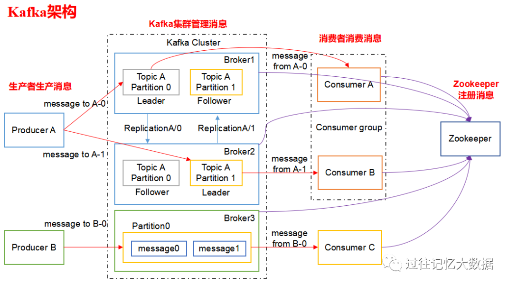
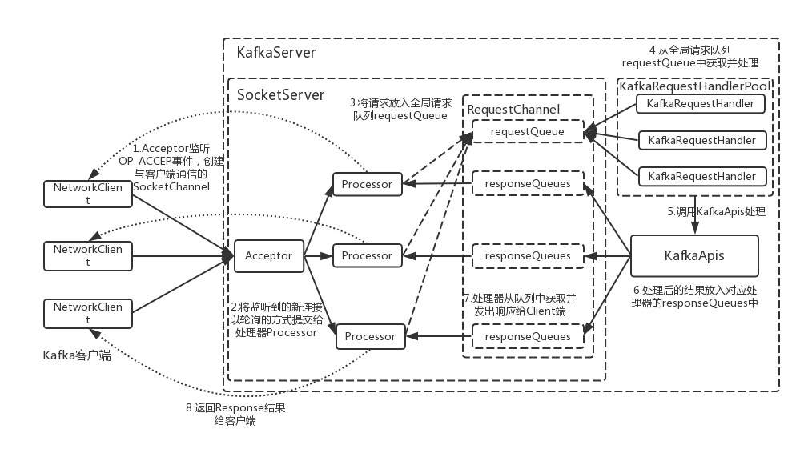
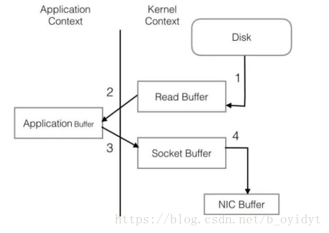
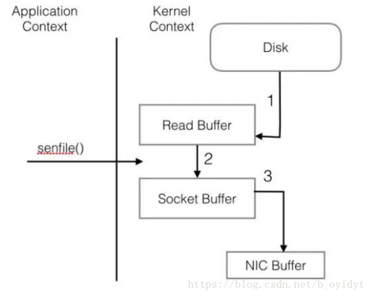

##### Kafka的优点？
 - 高吞吐，低延迟
 - 持久性、可靠性
 - 容错性
 - 高并发
 - 可扩展性
 
 

 
#### 名词解析
- **Producer** ：消息生产者，就是向 kafka broker 发消息的客户端。
- **Consumer** ：消息消费者，向 kafka broker 取消息的客户端。
- **Topic** ：可以理解为一个队列，一个 Topic 又分为一个或多个分区，
- **Consumer Group**：这是 kafka 用来实现一个 topic 消息的广播（发给所有的 consumer）和单播（发给任意一个 consumer）的手段。一个 topic 可以有多个 Consumer Group。
- **Broker** ：一台 kafka 服务器就是一个 broker。一个集群由多个 broker 组成。一个 broker 可以容纳多个 topic。
- **Partition**：为了实现扩展性，一个非常大的 topic 可以分布到多个 broker上，每个 partition 是一个有序的队列。partition 中的每条消息都会被分配一个有序的id（offset）。将消息发给 consumer，kafka 只保证按一个 partition 中的消息的顺序，不保证一个 topic 的整体（多个 partition 间）的顺序。
- **Offset**：kafka 的存储文件都是按照 offset.kafka 来命名，用 offset 做名字的好处是方便查找。例如你想找位于 2049 的位置，只要找到 2048.kafka 的文件即可。当然 the first offset 就是 00000000000.kafka。

### 3 高吞吐低延时

#### 3.1 写入
- 3.1.1 **利用Partition实现并行处理**   
   - Kafka中的每个Topic都包含一个或多个Partition，且它们位于不同节点。 
   - Partition在物理上对应一个本地文件夹，每个Partition包含一个或多个Segment，其中包含一个数据文件与一个索引文件。  
   - Partition像一个数组，可以通过索引（offset）去访问其数据。  
   - Kafka可以通过配置让同一节点的不同Partition置于不同的disk drive上，从而实现磁盘间的并行处理。  
> 具体方法：将不同磁盘mount到不同目录，在server.properties中，将log.dirs设置为多目录（逗号分隔），Kafka会自动将所有Partition均匀分配到不同disk上。

- 3.1.2 **顺序写入(Sequence I/O）**
 
    磁盘操作有以下几个好处： 
    > 1. 磁盘顺序读写速度超过内存随机读写
    > 1. JVM的GC效率低，内存占用大。使用磁盘可以避免这一问题
    > 1. 系统冷启动后，磁盘数据依然可用
    
- 3.1.3 **Memory Mapped Files（PageCache）**  
    当上层有写操作时，操作系统只是将数据写入 PageCache，同时标记 Page 属性为 Dirty。当读操作发生时，先从 PageCache 中查找，如果发生缺页才进行磁盘调度，最终返回需要的数据。
    实际上 PageCache 是把尽可能多的空闲内存都当做了磁盘缓存来使用。
    
- 3.1.4 **NIO**
    

#### 3.2 读取

- 3.2.1 **基于sendfile实现Zero Copy**  
    传统的网络 I/O 操作流程:
    
    
     Sendfile 优化后，整个 I/O 过程:
    

- 3.2.2 **批量压缩**
    - Kafka使用了批量压缩，即将多个消息一起压缩而不是单个消息压缩
    - Kafka允许使用递归的消息集合，批量的消息可以通过压缩的形式传输并且在日志中也可以保持压缩格式，直到被消费者解压缩
    - Kafka支持多种压缩协议，包括Gzip和Snappy压缩协议

#### 3.3 总结 
Kafka速度的秘诀在于，它把所有的消息都变成一个批量的文件，并且进行合理的批量压缩，减少网络IO损耗，通过mmap提高I/O速度，写入数据的时候由于单个Partion是末尾添加所以速度最优；读取数据的时候配合sendfile直接暴力输出。

[参考](https://www.jianshu.com/p/d0fc412bcf46)

