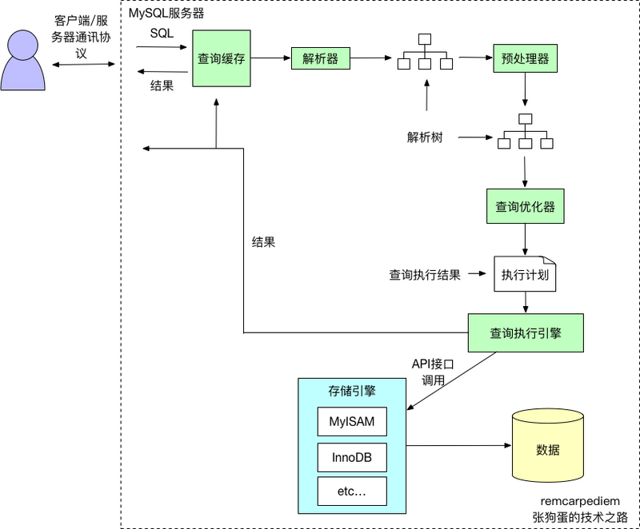
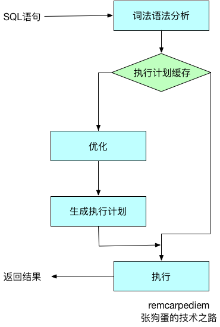

### 1. Mysql 执行过程

1. 客户端发送一条查询给服务器。
2. 服务器先检查查询缓存，如果命中了缓存，则立刻返回存储在缓存中的结果。否则进入下一阶段。
3. 服务器端进行SQL解析、预处理，再由优化器生成对应的执行计划。
4. MySQL根据优化器生成的执行计划，再调用存储引擎的API来执行查询。
5. 将结果返回给客户端。

### 2. 查询优化器
1. 查询优化器会将解析树转化成执行计划。
1. 一条查询可以有多种执行方法，最后都是返回相同结果。
1. 优化器的作用就是找到这其中最好的执行计划。
1. MySQL使用基于成本的查询优化器(Cost-Based Optimizer，CBO)。它会尝试预测一个查询使用某种执行计划时的成本，并选择其中成本最少的一个

