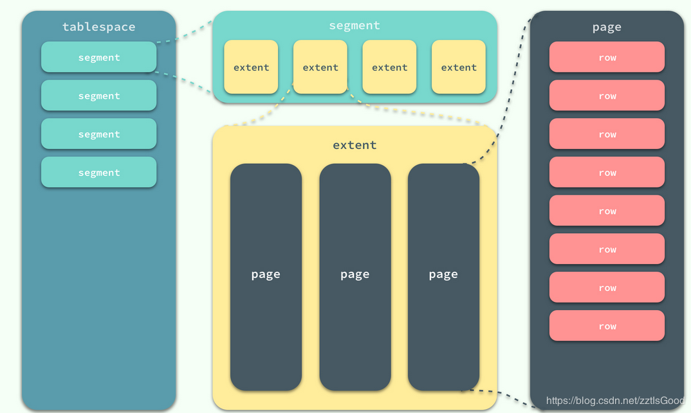
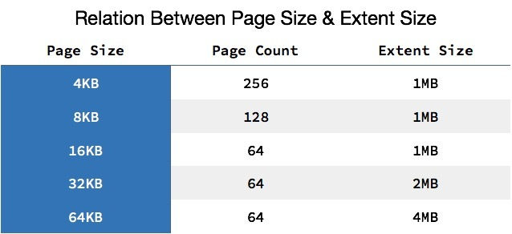
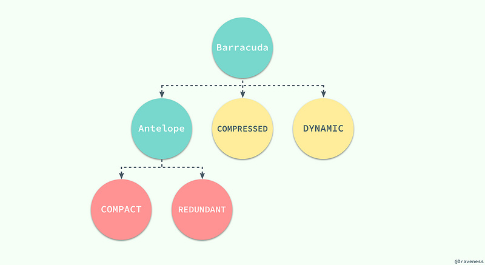
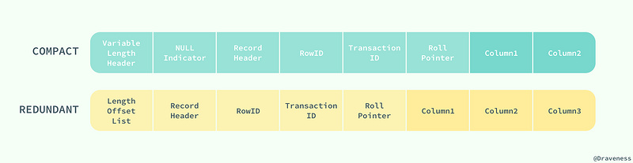

## 1. 索引的本质
MySQL官方对索引的定义为：索引（Index）是帮助MySQL高效获取数据的数据结构。目前大部分数据库系统及文件系统都采用B-Tree或其变种B+Tree作为索引结构

### **B 树**: 平衡树


### **B- 树**: 多路搜索树（并不是二叉的）

   1. 非叶子结点最多只有M个儿子，且M>2；
   2. 根结点的儿子数为[2, M]；
   3. 除根结点以外的非叶子结点的儿子数最少M/2（向上取整）；
   4. 所有叶子结点位于同一层；
   5. 每个结点存放至少M/2-1（向上取整）和至多M-1个关键字；（如下图根节点中25,50,75）
   6. 非叶子结点的关键字：K[1], K[2], …, K[M-1]；且K[i] < K[i+1]；（如下图根节点中25,50,75）
   7. 非叶子结点的指针：P[1], P[2], …, P[M]；（如下图根节点中灰色部分）
   8. 非叶子结点的关键字个数=指向儿子的指针个数-1；


> 四阶B-tree（M=4）

特点：
   1. 关键字集合分布在整颗树中；
   2. 任何一个关键字出现且只出现在一个结点中；
   3. 搜索有可能在非叶子结点结束；
   4. 其搜索性能等价于在关键字全集内做一次二分查找；
   5. 自动层次控制； 

### **B+ 树**：

   
   > 三阶B+tree（M=3）
   
   1. 其定义基本与B-树同，除了：
   2. 非叶子结点的子树指针与关键字个数相同；
   3. 为所有叶子结点增加一个链指针；
   4. 所有关键字都在叶子结点出现；

特性：

   1. 所有关键字都出现在叶子结点的链表中（稠密索引），且链表中的关键字恰好是有序的；
   2. 不可能在非叶子结点命中；
   3. 非叶子结点相当于是叶子结点的索引（稀疏索引），叶子结点相当于是存储（关键字）数据的数据层；
   4. 为所有叶子结点增加一个链指针；
   5. 所有关键字都在叶子结点出现； 
   6. 非叶子结点的子树指针与关键字个数相同
   7. 更适合文件索引系统； 
   

### **B* 树**
   1. B+ 树的变体，在 B+ 树的非根和非叶子结点再增加指向兄弟的指针；
   2. B* 树定义了非叶子结点关键字个数至少为 (2/3)*M ，即块的最低使用率为 2/3 （代替 B+ 树的 1/2 ）；

>   B+ 树的分裂：    
>   当一个结点满时，分配一个新的结点，并将原结点中 1/2 的数据复制到新结点，最后在父结点中增加新结点的指针；  
>   B+ 树的分裂只影响原结点和父结点，而不会影响兄弟结点，所以它不需要指向兄弟的指针；
>
>   B* 树的分裂：  
>   当一个结点满时，如果它的下一个兄弟结点未满，那么将一部分数据移到兄弟结点中，再在原结点插入关键字，
>   最后修改父结点中兄弟结点的关键字（因为兄弟结点的关键字范围改变了）；
>   如果兄弟也满了，则在原结点与兄弟结点之间增加新结点，
>   并各复制 1/3 的数据到新结点，最后在父结点增加新结点的指针；
>   所以， B* 树分配新结点的概率比 B+ 树要低，空间使用率更高； 


## 2. MySQL索引实现
B+ 树索引可以分为聚集索引（clustered index）和辅助/二级索引（secondary index）

### 2.1 MyISAM索引实现

默认储存引擎(5.5之前)，每个表对应三个文件：
1. .frm 文件保存表的定义，但是这个文件并不是MyISAM引擎的一部分，而是服务器的一部分；
1. .MYD 保存表的数据；
1. .MYI 是表的索引文件。

主索引


二级索引


#### 优点
1. 高性能读取；
2. 因为它保存了表的行数，当使用COUNT统计时不会扫描全表(包含where条件除外)；

#### 缺点
1. 锁级别为表锁，表锁优点是开销小，加锁快；缺点是锁粒度大，发生锁冲动概率较高，容纳并发能力低，适合查询为主的业务。
2. 此引擎不支持事务，也不支持外键。

#### 行存储
MyISAM有3种行存储格式：`fixed`、`dynamic`、`compressed`；

- **fixed**：为默认格式，只有当表不包含变长字段(varchar/varbinary/blob/text)时使用，该每行都是固定的，所以很容易获取行在页上的具体位置，存取效率比较高，但是占用磁盘空间较多；

- **dynamic**：每行都有一个行头部，包含bitmap，用以记录那些列为空(NULL列不算为空)；

相比于fixed，其有如下特性：
> 1. 所有字符串列都是动态存储的，除非长度小于4；
> 1. 字符类型若长度为0/数字类型为0都会不占用存储空间，由bitmap标注，NULL值不包含在内；
> 1. 如果要update行，其扩展后很容易导致行链接既而产生碎片，一旦crash若link丢失则比较难恢复，fixed模式update不会产生碎片；

- **compressed**：只能通过myisampack创建且为只读；

### 2.2 InnoDB索引实现
使用InnoDB时，会将数据表分为.frm(表结构) 和 idb(表数据和索引)两个文件进行存储。 
InnoDB表主键索引是基于聚簇索引建立的，聚簇索引对主键的查询有很高的性能，不过他的二级索引（非主键索引）必须包含主键列。

主键索引

> InnoDB表数据文件本身就是主索引

二级索引

> 索引的key是数据表的主键

#### 特点
1. 支持事务处理、ACID事务特性；
2. 实现了SQL标准的四种隔离级别；
3. 支持行级锁和外键约束；
4. 可以利用事务日志进行数据恢复。
5. 锁级别为行锁，行锁优点是适用于高并发的频繁表修改，高并发性能优于 MyISAM。缺点是系统消耗较大。
6. 索引不仅缓存自身，也缓存数据，相比 MyISAM 需要更大的内存。
7. 第辅助索引data域存储相应记录主键的值而不是地址。换句话说，InnoDB的所有辅助索引都引用主键作为data域


#### 页存储

在 InnoDB 存储引擎中，所有的数据都被逻辑地存放在表空间中，表空间（tablespace）是存储引擎中最高的存储逻辑单位，
在表空间的下面又包括段（segment）、区（extent）、页（page）


> 同一个数据库实例的所有表空间都有相同的页大小    
> 默认情况下，表空间中的页大小都为 16KB，可以通过innodb_page_size 选项对默认大小进行修改.`show variables like 'innodb_page_size'`
> 不同的页大小最终也会导致区大小的不同



系统表空间文件，包括 `ibdata1`、`ibdata2` 等文件，其中存储了 InnoDB 系统信息和用户数据库表数据和索引，是所有表公用的。

当打开`innodb_file_per_table`选项时，.ibd 文件就是每一个表独有的表空间，文件存储了当前表的数据和相关的索引数据。

#### 行存储
InnoDB只支持两种文件格式：`Antelope` 和 `Barracuda`。

**Antelope羚羊**: 原始的InnoDB文件格式。它支持两种行格式：compact 和 redundant。
MySQL5.6的默认文件格式。

**Barracuda梭子鱼**: 新的文件格式。它支持InnoDB的所有行格式，包括新的行格式：compressed 和 dynamic。





> **Compact** 和 **Redundant** 格式最大的不同就是记录格式的第一个部分；  
> **Compact**：行记录的第一部分倒序存放了一行数据中列的长度（Length）；
> **Redundant**：中存的是每一列的偏移量（Offset），从总体上上看，Compact 行记录格式相比 Redundant 格式能够减少 20% 的存储空间。

使用 Compact 或者 Redundant 格式存储变长的 VARCHAR 或者 BLOB 这类大对象时，我们并不会直接将所有的内容都存放在数据页节点中，而是将行数据中的前 **768** 个字节存储在数据页中，后面会通过偏移量指向溢出页。


但是当我们使用新的行记录格式 Compressed 或者 Dynamic 时都只会在行记录中保存 20 个字节的指针，实际的数据都会存放在溢出页面中。


> 当然在实际存储中，可能会对不同长度的 TEXT 和 BLOB 列进行优化


### 2.3 索引算法
#### Record Lock 记录锁
单个行记录上的锁，会锁住索引记录，如果建表时没有设置添加索引，Innodb会去锁定隐式的主键

#### Gap Lock 间隙锁
间隙锁是对索引记录中的一段连续区域的锁；锁定一个范围，但不包含记录本身
当使用类似 `SELECT * FROM users WHERE id BETWEEN 10 AND 20 FOR UPDATE;` 的 SQL 语句时，就会阻止其他事务向表中插入 id = 15 的记录，因为整个范围都被间隙锁锁定了。

**阻止的就是其他事务向这个范围中添加新的记录**

#### Next-Key Lock
Next-Key 它是记录锁和记录前的间隙锁的结合，锁定一个范围，并且包含记录本身
```
+------|-------------|--------------|-------+
|   id | last_name   | first_name   |   age |
|------|-------------|--------------|-------|
|    4 | stark       | tony         |    21 |
|    1 | tom         | hiddleston   |    30 |
|    3 | morgan      | freeman      |    40 |
|    5 | jeff        | dean         |    50 |
|    2 | donald      | trump        |    80 |
+------|-------------|--------------|-------+
```
Next-Key 锁就可以在需要的时候锁定以下的范围
```
(-∞, 21]
(21, 30]
(30, 40]
(40, 50]
(50, 80]
(80, ∞)
```
> Next-Key 锁锁定的是当前值及其前面的范围

`SELECT * FROM users WHERE age = 30 FOR UPDATE;`
InnoDB 不仅会在范围 (21, 30] 上加 Next-Key 锁，还会在这条记录后面的范围 (30, 40] 加间隙锁，所以插入 (21, 40] 范围内的记录都会被锁定
