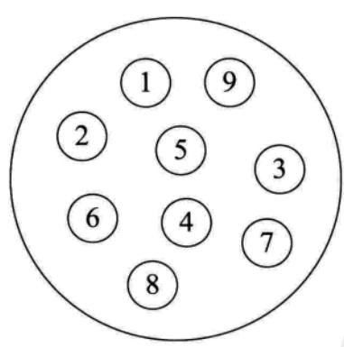
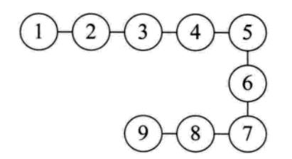
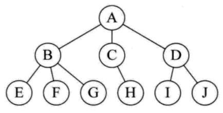
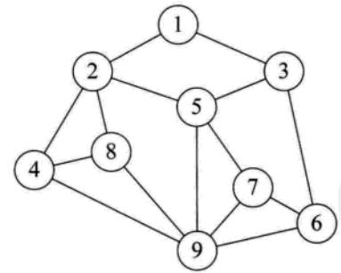
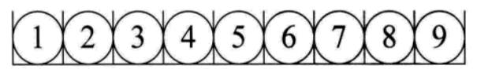
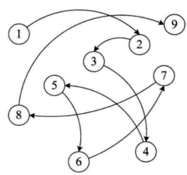

## 数据结构

### 逻辑结构（数据对象中数据元素之间的相互关系）：

- 集合结构：集合结构中的数据元素除了属于一个集合外，他们之间没有其他关系。

- 线性结构：线性结构中的数据元素之间是一对一的关系。

- 树形结构：树形结构中的数据元素之间存在一对多的层次关系。

- 图形结构：图像结构的数据元素是多对多的关系。

### 物理结构（指数据的逻辑结构在计算机的存储形式）：

- 顺序存储结构：是把数据元素存储到地址连续的存储单元里，其数据间的逻辑关系和物理关系是一致的。

- 链式存储结构：是把数据元素放到任意的存储单元中，这组存储单元可以是连续的，也可以是不连续的。

数据结构 | 查找 | 更新 | 插入 | 删除
---|---|---|---|---
数组 | O(1) | O(1) | O(n) | O(n)
链表 | O(n) | O(1) | O(1) | O(1)

### 1、数组 
数组是可以再内存中连续存储多个元素的结构，在内存中的分配也是连续的

优点：  
    1. 按照索引查询元素速度快  
    1. 按照索引遍历数组方便  

缺点：  
    1. 数组的大小固定后就无法扩容了  
    1. 数组只能存储一种类型的数据  
    1. 添加，删除的操作慢，因为要移动其他的元素。  

适用场景：
> 频繁查询，对存储空间要求不大，很少增加和删除的情况。

### 2、栈
栈的特点是：先进后出，或者说是后进先出，从栈顶放入元素的操作叫入栈，取出元素叫出栈。

### 3、队列
队列与栈一样，也是一种线性表，不同的是，队列可以在一端添加元素，在另一端取出元素，也就是：先进先出。从一端放入元素的操作称为入队，取出元素为出队，示例图如下：

使用场景：因为队列先进先出的特点，在多线程阻塞队列管理中非常适用。

### 4、链表
链表是物理存储单元上非连续的、非顺序的存储结构，数据元素的逻辑顺序是通过链表的指针地址实现，根据指针的指向，链表能形成不同的结构，例如单链表，双向链表，循环链表等。

链表的优点：
链表是很常用的一种数据结构，不需要初始化容量，可以任意加减元素；
添加或者删除元素时只需要改变前后两个元素结点的指针域指向地址即可，所以添加，删除很快；

缺点：
1. 因为含有大量的指针域，占用空间较大；
2. 查找元素需要遍历链表来查找，非常耗时。

适用场景：
1. 数据量较小，需要频繁增加，删除操作的场景

### 5、树
树是一种数据结构，它是由n（n>=1）个有限节点组成一个具有层次关系的集合。
把它叫做 “树” 是因为它看起来像一棵倒挂的树，也就是说它是根朝上，而叶朝下的。它具有以下的特点：

每个节点有零个或多个子节点；
没有父节点的节点称为根节点；
每一个非根节点有且只有一个父节点；
除了根节点外，每个子节点可以分为多个不相交的子树；
在日常的应用中，我们讨论和用的更多的是树的其中一种结构，就是二叉树。

二叉树是树的特殊一种，具有如下特点：

1、每个结点最多有两颗子树，结点的度最大为2。
2、左子树和右子树是有顺序的，次序不能颠倒。
3、即使某结点只有一个子树，也要区分左右子树。

二叉树是一种比较有用的折中方案，它添加，删除元素都很快，并且在查找方面也有很多的算法优化，所以，二叉树既有链表的好处，也有数组的好处，是两者的优化方案，在处理大批量的动态数据方面非常有用。

扩展：
二叉树有很多扩展的数据结构，包括平衡二叉树、红黑树、B+树等，这些数据结构二叉树的基础上衍生了很多的功能，在实际应用中广泛用到，例如mysql的数据库索引结构用的就是B+树，还有HashMap的底层源码中用到了红黑树。这些二叉树的功能强大，但算法上比较复杂，想学习的话还是需要花时间去深入的。

二叉树：
- 满二叉树：所有非叶子节点都是2个儿子，而且所有叶子节点在同一层
- 完全二叉树：除去最后一层必须是满二叉树，最后一层从左到右必须不能留空

- 二叉查找树/二叉搜索树/二叉排序树: 左节点小于根节点，右节点大于根节点
深度优先（前序遍历，中序遍历，后序遍历），广度优先（从上到下从左到右）

二叉堆-本质上是完全二叉树

### 6、散列表
散列表，也叫哈希表，是根据关键码和值 (key和value) 直接进行访问的数据结构，通过key和value来映射到集合中的一个位置，这样就可以很快找到集合中的对应元素。

记录的存储位置=f(key)

这里的对应关系 f 成为散列函数，又称为哈希 (hash函数)，而散列表就是把Key通过一个固定的算法函数既所谓的哈希函数转换成一个整型数字，然后就将该数字对数组长度进行取余，取余结果就当作数组的下标，将value存储在以该数字为下标的数组空间里，这种存储空间可以充分利用数组的查找优势来查找元素，所以查找的速度很快。

哈希表在应用中也是比较常见的，就如Java中有些集合类就是借鉴了哈希原理构造的，例如HashMap，HashTable等，利用hash表的优势，对于集合的查找元素时非常方便的，然而，因为哈希表是基于数组衍生的数据结构，在添加删除元素方面是比较慢的，所以很多时候需要用到一种数组链表来做，也就是拉链法。拉链法是数组结合链表的一种结构，较早前的hashMap底层的存储就是采用这种结构，直到jdk1.8之后才换成了数组加红黑树的结构，其示例图如下：

从图中可以看出，左边很明显是个数组，数组的每个成员包括一个指针，指向一个链表的头，当然这个链表可能为空，也可能元素很多。我们根据元素的一些特征把元素分配到不同的链表中去，也是根据这些特征，找到正确的链表，再从链表中找出这个元素。

哈希表的应用场景很多，当然也有很多问题要考虑，比如哈希冲突的问题，如果处理的不好会浪费大量的时间，导致应用崩溃。

### 7、堆
堆是一种比较特殊的数据结构，可以被看做一棵树的数组对象，具有以下的性质：

堆中某个节点的值总是不大于或不小于其父节点的值；

堆总是一棵完全二叉树。

将根节点最大的堆叫做最大堆或大根堆，根节点最小的堆叫做最小堆或小根堆。常见的堆有二叉堆、斐波那契堆等。

堆的定义如下：n个元素的序列{k1,k2,ki,…,kn}当且仅当满足下关系时，称之为堆。
(ki <= k2i,ki <= k2i+1)或者(ki >= k2i,ki >= k2i+1), (i = 1,2,3,4…n/2)，满足前者的表达式的成为小顶堆，满足后者表达式的为大顶堆，这两者的结构图可以用完全二叉树排列出来，示例图如下：

因为堆有序的特点，一般用来做数组中的排序，称为堆排序。

### 8、图
图是由结点的有穷集合V和边的集合E组成。其中，为了与树形结构加以区别，在图结构中常常将结点称为顶点，边是顶点的有序偶对，若两个顶点之间存在一条边，就表示这两个顶点具有相邻关系。

按照顶点指向的方向可分为无向图和有向图：

图是一种比较复杂的数据结构，在存储数据上有着比较复杂和高效的算法，分别有邻接矩阵 、邻接表、十字链表、邻接多重表、边集数组等存储结构，这里不做展开，读者有兴趣可以自己学习深入。
